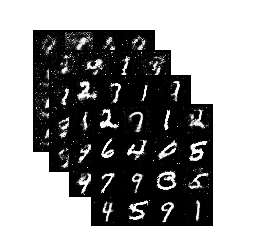

# imgs2gif
gif creator from multiple images in pure Python.

### Introduction
<p align="center">
  
  
  
</p>
<p align="center">
    Digits generation via GAN.
</p>

The purpuse of this reposetory is to provide a quick solution to produce high quality and nice gifs of your experiments.

<p align="center">
  
</p>
<p align="center">
    GAN training progress.
</p>

### Running
One option is to run the sample code by typing:

```
./imgs2gif.py --image_path="folder_path"
```
A second is to import is as
```
from imgs2gif.py import imgs2gif

imgs2gif("folder_path")
```